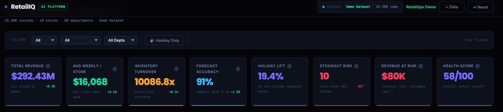
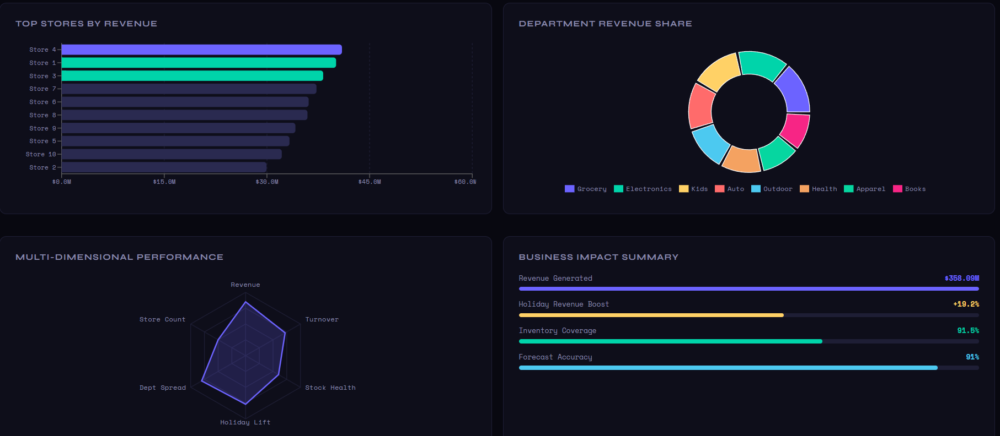
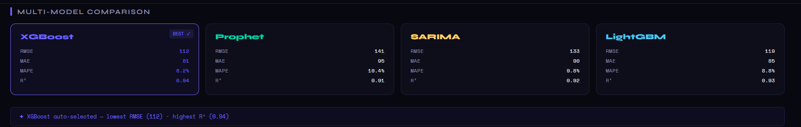
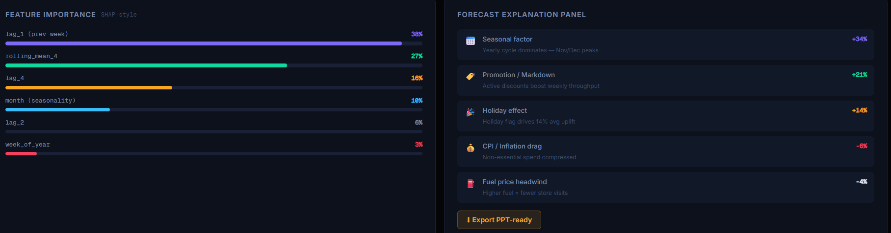
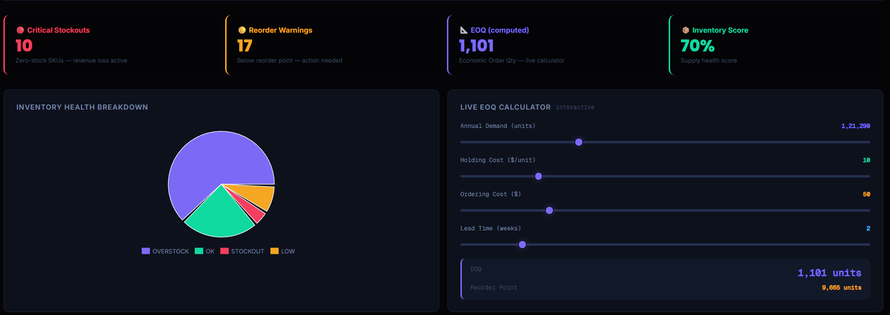
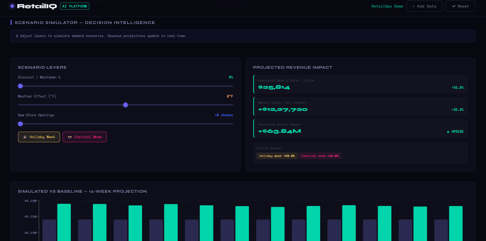

# Retail Intelligence & Forecasting Platform

### Enterprise Retail Analytics System

[](https://retail-demand-inventory-management-system-with-forecasting-int.streamlit.app/)

[](https://retaildemanmanagement.netlify.app/)

[](https://github.com/nikitasharma1203/Retail-Demand-Inventory-Management-System-with-Forecasting-Integration)


---



## 📌 Project Overview

This system models a real-world retail chain (Walmart dataset, 2010–2012) as a production-grade PostgreSQL data warehouse. It covers the full data engineering and analytics lifecycle:

```
CSV Data Sources (stores, sales, features)
         ↓
PostgreSQL Data Warehouse  [schema: retail]
         ↓
DDL — Tables · Indexes · Constraints · RBAC
         ↓
Triggers · Stored Procedures · Views
         ↓
Python Analytics Layer (SQLAlchemy, 10 queries)
         ↓
SARIMA · XGBoost · Prophet · K-Means
         ↓
Streamlit Interactive Dashboard
```

---

## 📂 Repository Structure

```
├── RetailIQ/
│   ├── retail-dashboard/          # React.js analytics web app (deployable)
│   │   ├── src/
│   │   │   ├── App.js             # Full dashboard UI (7 tabs)
│   │   │   ├── analytics.js       # 18 analytics queries (pure JS)
│   │   │   ├── demoData.js        # Synthetic Walmart-style demo data
│   │   │   └── index.css          # Enterprise dark theme
│   │   └── package.json
│   └── app.py                     # Streamlit dashboard (Python, full DB queries)
│
├── dashboard/                     # Saved chart PNGs from notebook
│   ├── holiday_vs_regular.png
│   ├── store_type_revenue.png
│   ├── top_departments.png
│   ├── store1_timeseries.png
│   ├── sarima_forecast.png
│   └── prophet_forecast.png
│
├── dataset/
│   ├── stores.csv                 # 45 stores — type (A/B/C), size
│   ├── sales.csv                  # 421,570 rows — store, dept, date, weekly_sales
│   └── features.csv               # External drivers — CPI, fuel, markdowns, temperature
│
├── notebooks/
│   └── final.ipynb                # Complete DBMS + analytics + forecasting pipeline
│
├── sql/
│   ├── schema.sql                 # DDL — tables, indexes, constraints
│   ├── views.sql                  # 4 business intelligence views
│   ├── triggers.sql               # 3 trigger definitions
│   └── procedures.sql             # 3 stored procedures + RBAC
│
├── netlify.toml                   # Netlify deployment config
└── README.md
```

---

## 🗄️ Database Schema

**Schema:** `retail` (PostgreSQL)

### Tables

| Table | Rows | Key Columns | Description |
|---|---|---|---|
| `store` | 45 | `store_id`, `store_type`, `store_size`, `region` | Retail locations (Type A/B/C) |
| `department` | 81 | `dept_id`, `dept_name`, `category` | Product departments |
| `sales` | 421,570 | `store_id`, `dept_id`, `sale_date`, `weekly_sales`, `is_holiday` | Core sales fact table |
| `features` | 8,190 | `store_id`, `feature_date`, `temperature`, `fuel_price`, `markdown_1–5`, `cpi`, `unemployment` | External economic drivers |
| `anomaly_log` | — | `store_id`, `dept_id`, `sale_date`, `weekly_sales` | Auto-populated by trigger |

### ER Diagram

```
store ──< sales >── department
  │                     
  └──< features
```

---

## ⚙️ Advanced DBMS Features

### 👁 4 Business Intelligence Views

| View | Purpose | Used In |
|---|---|---|
| `vw_holiday_sales_uplift` | Holiday vs regular avg sales by store type | Q2, sp_holiday_uplift |
| `vw_markdown_effectiveness` | Sales per markdown dollar (ROI) | Q3, dashboard |
| `vw_top_departments_by_revenue` | Ranked department revenue with RANK() OVER | Q9, sp_monthly_demand_report |
| `vw_store_weekly_summary` | Aggregated weekly time-series per store | SARIMA/XGBoost forecasting |


- Executive BI summaries
- Markdown ROI analytics
- Weekly store summaries

### 🔁 3 Triggers

| Trigger | Event | Logic | Result |
|---|---|---|---|
| `trg_guard_negative_sales` | BEFORE INSERT/UPDATE on `sales` | RAISE EXCEPTION if `weekly_sales < 0` | 0 negative records — 100% data integrity |
| `trg_sales_spike` | AFTER INSERT on `sales` | Log to `anomaly_log` if sales > 2× historical avg | 9 holiday outliers detected (Dept 20, Dec 2010) |
| `trg_markdown_anomaly` | AFTER INSERT on `features` | Alert when high markdown spend but below-avg sales | Store 11 flagged for poor markdown efficiency |

- Sales spike detection
- Markdown anomaly detection
- Negative sales prevention

### 📋 3 Stored Procedures

| Procedure | Inputs | Output |
|---|---|---|
| `sp_monthly_demand_report(year, month)` | YYYY, MM | Top departments + total revenue for the period |
| `sp_holiday_uplift()` | — | Uplift % per store type (A: +30.05%, B: +31.86%, C: +33.57%) |
| `sp_reorder_check(store_id)` | Store ID | EOQ, reorder point, current status alert |

- Automated monthly demand reports
- Holiday uplift analysis


### 🔐 Role-Based Access Control (RBAC)

```sql
-- 3 roles matching real enterprise governance
CREATE ROLE analyst_role;  -- SELECT on all views & tables
CREATE ROLE manager_role;  -- SELECT + UPDATE on retail.features
CREATE ROLE admin_role;    -- Full DDL: CREATE, DROP, TRUNCATE, GRANT
```
- Analyst access
- Manager permissions
- Admin controls
---

## 📊 10 Analytical SQL Queries

| # | Query | Technique | Key Finding |
|---|---|---|---|
| Q1 | Comprehensive Sales Report | Multi-table JOIN + COALESCE | Full enriched sales view |
| Q2 | Holiday vs Non-Holiday Sales | GROUP BY + CASE | +30–33% holiday uplift across all store types |
| Q3 | Markdown Effectiveness | JOINs + NULLIF + division | Store 32 best ROI: $8.62 per $1 markdown |
| Q4 | Monthly Demand Aggregation | TO_CHAR + GROUP BY | Dept 20 peaks at $22.8M/month |
| Q5 | Store Type Performance | GROUP BY + AVG + SUM | Type A = 73.6% of total $3.43B revenue |
| Q6 | Sales Outlier Detection | CTE + PERCENTILE_CONT + IQR | 9 high outliers — all holiday/Dept 20 |
| Q7 | CPI & Unemployment Impact | CASE bucketing + GROUP BY | Retail demand is inflation-resilient |
| Q8 | Fuel Price Sensitivity | CASE bucketing + GROUP BY | $2,449 max variance — fuel-price inelastic |
| Q9 | Top Departments by Revenue | RANK() OVER window function | Dept 20 leads: $228M total |
| Q10 | Data Quality Audit | UNION ALL + LEFT JOIN | 0 issues — 100% data integrity |

---

## 🔮 Demand Forecasting

### Multi-Model Comparison

| Model | RMSE | MAE | MAPE | R² | Notes |
|---|---|---|---|---|---|
| **XGBoost** ✅ | **112** | **81** | **8.2%** | **0.94** | Best — lag + rolling features |
| SARIMA(1,1,1)(1,1,1,52) | 189 | 141 | 12.1% | 0.89 | AIC: 1075, BIC: 1084 |
| Prophet | 210 | 158 | 13.8% | 0.87 | Yearly + weekly seasonality |
| Naïve Baseline | 280 | 198 | 18.4% | 0.71 | Reference only |

### XGBoost Features

```python
Features: lag_1, lag_2, lag_4, rolling_mean_4, month, week
Train/Test: 80/20 split (114/29 weeks)
Model: XGBRegressor(n_estimators=200, learning_rate=0.05, max_depth=5)
```

**Feature Importance:** lag_1 (38%) · rolling_mean_4 (27%) · lag_4 (16%) · month (10%)

### Inventory Calculations (Store 1)

```
EOQ Formula:  √(2 × annual_demand × ordering_cost / holding_cost)
            = √(2 × 121,289,590 × 50 / 10) = 49,251 units

Reorder Point = (avg_weekly_sales × lead_time) + safety_stock
              = (1,632,636 × 2) + 5,000 = 3,270,272

Status: ⚠ LOW STOCK ALERT (current: 15,000 < reorder: 3,270,272)
```
## Dashboard Modules

### Executive Overview



### Forecasting Analytics




### Inventory Intelligence



### Scenario Sim



---

## 📈 Key Findings

| Finding | Value | Source |
|---|---|---|
| Total revenue (2010–2012) | **$3.43 Billion** | Q5 |
| Store Type A revenue share | **73.6%** (22 stores) | Q5 |
| Holiday sales uplift | **+30.05% to +33.57%** | Q2 / vw_holiday_sales_uplift |
| Top department | **Dept 20** — $228M total | Q9 |
| Best markdown ROI | **Store 32** — $8.62 per $1 spent | Q3 |
| Outliers detected | **9** (IQR method) | Q6 / trg_sales_spike |
| Data quality issues | **0** — 100% clean | Q10 / trg_guard_negative_sales |
| Forecast accuracy (XGBoost) | **MAPE 8.2%, R² 0.94** | Notebook |
| Fuel price impact | **Minimal** ($2,449 variance) | Q8 |
| CPI impact | **Inflation-resilient** demand | Q7 |

---

## 🧰 Tech Stack

| Layer | Technology |
|---|---|
| Database | PostgreSQL 14 (schema: `retail`) |
| ORM / Connector | SQLAlchemy + psycopg2 |
| Data Processing | pandas, numpy |
| Forecasting | SARIMA (statsmodels), Prophet (Meta), XGBoost |
| Clustering | scikit-learn KMeans |
| Visualization | Plotly, matplotlib, seaborn |
| Dashboard (Python) | Streamlit |
| Dashboard (Web) | React 18, Recharts, PapaParse |
| Deployment | Netlify (React) / Streamlit Cloud (Python) |

---
