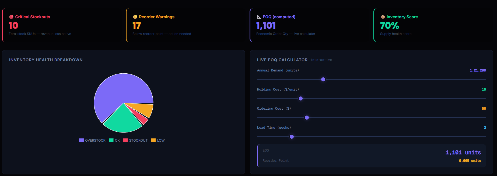
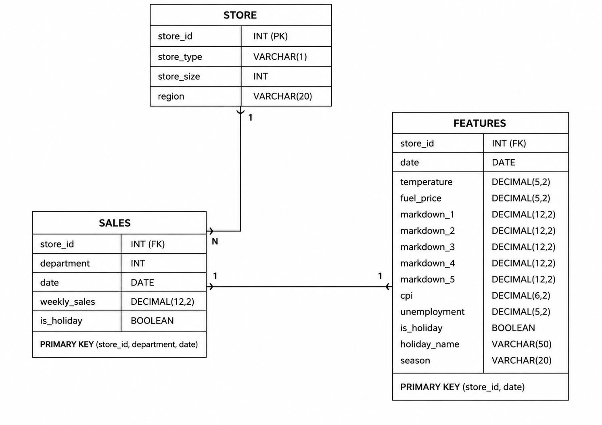

# RetailIQ  
### Retail Demand Forecasting & Inventory Intelligence Platform

[](https://public.tableau.com/app/profile/nikita.sharma8845/viz/RetailDashboard_17813393737740/Dashboard1)
[](https://retailiqplatform.netlify.app/)
[](https://github.com/nikitasharma1203/Retail-Demand-Inventory-Management-System-with-Forecasting-Integration/actions/workflows/ci.yml)
[](https://github.com/nikitasharma1203/Retail-Demand-Inventory-Management-System-with-Forecasting-Integration/actions/workflows/cd.yml)
[](https://www.postgresql.org/)
[]()
[]()

## Dashboard Preview



Production-grade retail analytics platform built on Walmart's **421,570-row retail dataset**. The project integrates **data warehousing, business intelligence, demand forecasting, inventory optimisation, and a CI/CD pipeline** to support data-driven retail decision making.

---

# Key Capabilities

- Weekly demand forecasting at store level
- Promotion and markdown effectiveness analysis
- Inventory optimisation using **EOQ** and **Reorder Point**
- Revenue and department performance analysis
- Macroeconomic impact analysis (CPI, unemployment, fuel prices)
- Dashboard for business decision making
- Automated CI/CD pipeline with lint, SQL validation, unit tests, and notebook smoke testing

---

# Business Questions Solved

- How much inventory should each store hold?
- Which promotions generate the highest return on investment?
- How do holidays influence consumer demand?
- Which departments contribute the most revenue?
- Which forecasting approach best predicts weekly sales?
- How do inflation and fuel prices affect retail performance?

---

# Web Application Features

Designed the product workflow and business logic, and implemented an interactive retail intelligence web application using AI-assisted development.

- Upload retail datasets and explore a demo dataset
- Monitor revenue, inventory and forecast KPIs
- Generate demand forecasts using SARIMA, Prophet and XGBoost
- Detect stockouts and optimise replenishment decisions
- Simulate promotions and holiday demand scenarios
- Receive AI-generated business insights

---

# Key Results

| Metric | Value |
|---|---|
| Best Statistical Model | **SARIMA** |
| SARIMA | **MAE = 504, RMSE = 581, MAPE = 0.03%** |
| Prophet | **MAE = 48,535, RMSE = 59,312, MAPE = 2.98%** |
| XGBoost | **MAE = 20,859, RMSE = 34,588, MAPE = 1.17%** |
| Total Revenue Analysed | **$3.43 Billion** |
| Holiday Sales Uplift | **+30% to +33%** |
| Best Markdown ROI | **Store 32 → $8.62 revenue per $1 markdown** |
| Data Integrity Issues | **0 across 421K rows** |
| Unit Tests | **13/13 passing** |
| CI Jobs | **4/4 green** |

---

# System Architecture

```text
CSV Data Sources (stores · sales · features)
              ↓
PostgreSQL Data Warehouse [schema: retail]
              ↓
DDL · Constraints · Indexes · RBAC
              ↓
Triggers · Stored Procedures · BI Views
              ↓
Python Analytics Layer
(Pandas · SQLAlchemy · NumPy)
              ↓
SARIMA · Prophet · XGBoost · KMeans
              ↓
Tableau Dashboard + React Web App
              ↓
GitHub Actions CI/CD Pipeline
(Lint · SQL Validate · Tests · Notebook Smoke Test)
```

---

# CI/CD Pipeline

This project uses **GitHub Actions** to automatically validate code quality, SQL schema integrity, unit test coverage, and notebook execution on every push to `main`.

## Workflows

| Workflow | Trigger | Purpose |
|---|---|---|
| `ci.yml` | Every push & PR | Lint · SQL lint · Unit tests · Notebook smoke test |
| `cd.yml` | Every push & PR | React app build check + artifact upload |
| `sql-validate.yml` | Changes to `sql/` | Loads all SQL files into a live PostgreSQL 14 container |

## CI Pipeline — Job Breakdown

```
push to main
    │
    ├── Python Lint (flake8)          ✅  Checks notebooks/ for style issues
    │
    ├── SQL Lint (sqlfluff)           ✅  Checks sql/ for formatting and syntax
    │
    ├── Tests + Coverage (pytest)     ✅  13 unit tests — EOQ, ROP, holiday uplift,
    │                                     data quality checks
    │
    └── Notebook Smoke Test           ✅  Converts final.ipynb to script,
                                          extracts import-only lines,
                                          proves all packages load on a clean machine
```

## Build Check — Job Breakdown

```
push to main
    │
    └── npm install + npm run build   ✅  Builds React app in retail-dashboard/
                                          Saves build/ as downloadable artifact (7 days)
                                          → drag-and-drop to Netlify to deploy
```

## SQL Schema Validation (on sql/ changes)

```
sql/ file changed
    │
    ├── Spin up PostgreSQL 14 container
    ├── Load schema.sql  (tables, constraints, indexes)
    ├── Load views.sql   (BI views)
    ├── Load triggers.sql
    ├── Load procedures.sql
    └── Smoke queries    (verify tables, views, procedures exist)
```

## Files Added for CI/CD

```text
.github/
└── workflows/
    ├── ci.yml              → Main CI pipeline (lint + tests + notebook)
    ├── cd.yml              → React build check (no deploy secrets needed)
    └── sql-validate.yml    → PostgreSQL schema load test

ci_smoke_test.py            → Parses notebook script, extracts clean imports,
                              skips DB/prophet calls — runs import-only validation

tests/
├── __init__.py
└── test_retailiq_analytics.py   → 13 unit tests covering:
                                    - EOQ calculation (5 tests)
                                    - ROP calculation (3 tests)
                                    - Holiday sales uplift (2 tests)
                                    - Data quality checks (3 tests)
```

---

# Database Schema



The original Walmart dataset did not include a department dimension table. A synthetic department table was created using unique department IDs from the sales fact table and enriched with department names and category labels to maintain a normalized star schema.

---

# Database Design

**Schema:** `retail`

| Table | Rows | Description |
|---|---:|---|
| store | 45 | Store metadata — type, size, region |
| department | 81 | Department dimension |
| sales | 421,570 | Weekly sales fact table |
| features | 8,190 | External drivers (CPI, fuel, markdowns, holidays) |
| anomaly_log | Auto | Trigger-generated anomaly logs |

---

# Business Intelligence Views

| View | Purpose |
|---|---|
| `vw_holiday_sales_uplift` | Holiday vs regular average sales |
| `vw_markdown_effectiveness` | Revenue per markdown dollar |
| `vw_top_departments_by_revenue` | Department ranking using window functions |
| `vw_store_weekly_summary` | Weekly aggregated time series |

---

# Triggers

| Trigger | Logic |
|---|---|
| `trg_guard_negative_sales` | Prevents insertion of negative sales |
| `trg_sales_spike` | Logs sales spikes above 2× historical average |
| `trg_markdown_anomaly` | Flags abnormal markdown spending |

---

# Stored Procedures

| Procedure | Purpose |
|---|---|
| `sp_monthly_demand_report(year, month)` | Monthly revenue and department ranking |
| `sp_holiday_uplift()` | Holiday uplift by store type |
| `sp_reorder_check(store_id)` | EOQ, reorder point and stock alerts |

---

# Role Based Access Control (RBAC)

```sql
CREATE ROLE analyst_role;
-- SELECT access on tables and views

CREATE ROLE manager_role;
-- SELECT + UPDATE on retail.features

CREATE ROLE admin_role;
-- Full DDL permissions
```

---

# Analytical SQL Queries

| Query | Business Insight |
|------|-------------------|
| **Q1. Comprehensive Sales Report** | Unified view of sales, promotions, store characteristics, and macroeconomic factors to understand retail demand drivers. |
| **Q2. Holiday Sales Uplift** | Holiday weeks increase average sales by **30–33%** across all store types, highlighting the need for targeted promotions and inventory planning. |
| **Q3. Markdown Effectiveness** | Store 32 achieved the highest markdown ROI with **$8.62 revenue per $1 spent**, showing promotions are most effective when paired with strong baseline demand. |
| **Q4. Monthly Demand Aggregation** | December is the peak sales month, with Departments **15, 16, 17, 19, and 20** exceeding **$3.5M** monthly revenue. |
| **Q5. Store Type Performance** | Type A stores contribute **$2.5B** revenue, significantly outperforming Types B and C due to larger size and higher sales volumes. |
| **Q6. Sales Outlier Detection** | Departments 19 and 20 show extreme demand spikes (>300K weekly sales), emphasizing the need for safety stock and robust forecasting. |
| **Q7. CPI & Unemployment Impact** | Inflation impacts sales more strongly than unemployment, making CPI an important variable in demand forecasting. |
| **Q8. Fuel Price Sensitivity** | Fuel prices show weak correlation (**0.016**) with weekly sales, suggesting limited direct impact on consumer demand. |
| **Q9. Top Departments by Revenue** | Departments **20, 19, and 18** are the largest revenue contributors, making them priorities for forecasting and inventory optimisation. |
| **Q10. Data Quality Audit** | Achieved **0 integrity issues** across **421,570 rows**, ensuring reliable analytics and forecasting. |

---

# Demand Forecasting

Three forecasting approaches were evaluated for weekly retail demand prediction.

| Model | MAE | RMSE | MAPE |
|---|---:|---:|---:|
| **SARIMA** | **504** | **581** | **0.03%** |
| Prophet | 48,535 | 59,312 | 2.98% |
| XGBoost | 20,859 | 34,588 | 1.17% |

---

## SARIMA

- Strongest statistical performance
- Captures seasonality and autocorrelation effectively
- Annual seasonality retained (`s = 52`)
- MAPE = **0.03%**

**Strengths**

- Excellent statistical fit
- Interpretable time-series behaviour

**Limitations**

- Sensitive to sudden holiday spikes
- Seasonal coefficients remain unstable

---

## Prophet

Prophet decomposes sales into:

- Trend
- Weekly seasonality
- Yearly seasonality
- Holiday effects

### Key Insights

- Demand declines from 2022–2023 and recovers afterwards
- Weekly peaks occur around Thursday and Saturday
- Yearly peaks occur around May with troughs around November

**MAPE = 2.98%**

---

## XGBoost

Features:

```python
lag_1
lag_2
lag_4
rolling_mean_4
month
week
```

**Feature Importance**

| Feature | Importance |
|---|---:|
| lag_1 | 38% |
| rolling_mean_4 | 27% |
| lag_4 | 16% |
| month | 10% |

**MAPE = 1.17%**

XGBoost effectively captures non-linear interactions among historical sales, promotions, CPI, fuel prices, and holidays, making it suitable for operational demand forecasting.

---

# Store Segmentation

K-Means clustering segments stores into:

| Cluster | Interpretation |
|---|---|
| Cluster 1 | High-sales flagship stores |
| Cluster 0 | Average performers |
| Cluster 2 | Low-performing stores |

Sales volume is the primary driver of clustering, while economic indicators vary minimally across groups.

---

# Inventory Optimisation

Inventory replenishment is automated using:

### Reorder Point (ROP)

```text
ROP = Demand during lead time + Safety Stock
```

### Economic Order Quantity (EOQ)

```text
EOQ = √(2DS / H)
```

where:

- D → Annual demand
- S → Ordering cost
- H → Holding cost

**Example**

```text
EOQ = 15,561 units

ROP = 3,270,272 units
```

Together:

- **ROP** determines *when* to order
- **EOQ** determines *how much* to order

These rules form the foundation of automated inventory control.

---

# Tech Stack

| Layer | Technology |
|---|---|
| Database | PostgreSQL 14 |
| ORM | SQLAlchemy, psycopg2 |
| Data Processing | Pandas, NumPy |
| Forecasting | SARIMA, Prophet, XGBoost |
| Clustering | K-Means |
| Visualisation | Plotly, Matplotlib, Seaborn |
| Dashboard | Tableau |
| Dashboard (Web) | React 18 |
| Deployment | Netlify |
| CI/CD | GitHub Actions |
| Testing | pytest (13 tests, 100% coverage) |
| Code Quality | flake8, sqlfluff |

---

# Repository Structure

```text
Retail-Demand-Inventory-Management-System-with-Forecasting-Integration/

├── .github/
│   └── workflows/
│       ├── ci.yml              → Lint · SQL · Tests · Notebook smoke test
│       ├── cd.yml              → React build check + artifact upload
│       └── sql-validate.yml    → PostgreSQL schema load validation

├── retail-dashboard/
│   └── src/
│       ├── App.js
│       ├── analytics.js
│       └── demoData.js

├── assets/                     → Dashboard screenshots

├── notebooks/
│   └── final.ipynb             → Full analytics pipeline

├── sql/
│   ├── schema.sql
│   ├── views.sql
│   ├── triggers.sql
│   └── procedures.sql

├── tests/
│   ├── __init__.py
│   └── test_retailiq_analytics.py   → 13 unit tests (EOQ, ROP, data quality)

├── dataset/
│   ├── stores.csv
│   ├── sales.csv
│   └── features.csv

└── ci_smoke_test.py            → Notebook import validator for CI
```
